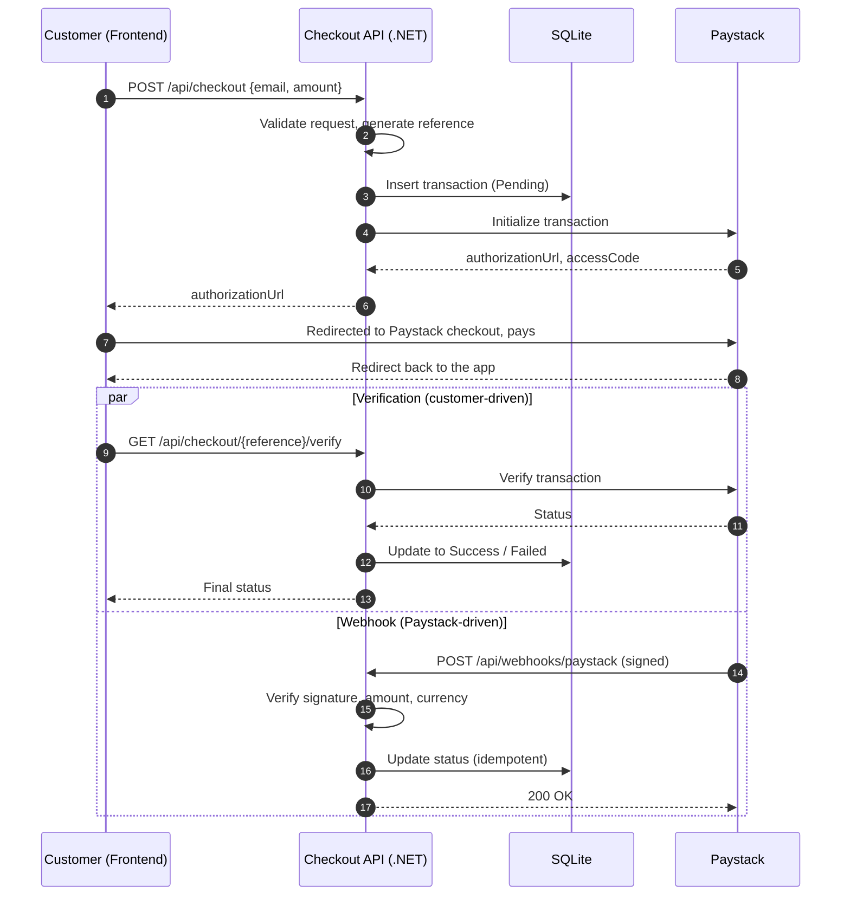

# FintechCheckout

A full-stack **payment checkout application** built with a **.NET 10 Web API** backend and a **web frontend**, integrated with **Paystack** to initialize, verify, and securely process payments.

**Live demo:** [fintech-checkout.vercel.app](https://fintech-checkout.vercel.app/)

> **Core principle:** the application owns the transaction state; Paystack is only the payment gateway.

---

## Table of Contents

1. [Overview](#overview)
2. [Features](#features)
3. [How It Works](#how-it-works)
4. [Architecture](#architecture)
5. [Tech Stack](#tech-stack)
6. [Project Structure](#project-structure)
7. [Getting Started](#getting-started)
8. [Configuration Reference](#configuration-reference)
9. [API Reference](#api-reference)
10. [Security](#security)
11. [Idempotency](#idempotency)
12. [Database](#database)
13. [Testing the Payment Flow](#testing-the-payment-flow)
14. [Deployment](#deployment)
15. [Design Decisions](#design-decisions)
16. [Roadmap](#roadmap)
17. [Troubleshooting](#troubleshooting)

---

## Overview

FintechCheckout demonstrates how a real checkout system is put together. A customer enters their email and an amount in the frontend, the backend records the transaction and asks Paystack to create a payment session, and the customer is redirected to Paystack's hosted checkout page to pay. Once the payment completes, the backend confirms the result in two independent ways (a verification call and a signed webhook) and updates its own database.

The project focuses on the things that matter in financial software:

- Never trusting the client for payment status
- Verifying that webhooks genuinely come from Paystack
- Checking the amount and currency before marking anything as paid
- Handling duplicate webhook deliveries safely
- Keeping an auditable record of every transaction

---

## Features

**Checkout**
- Checkout form with request validation (email and amount)
- Unique transaction reference generated for every checkout
- Redirect to Paystack's hosted payment page
- Payment verification endpoint to confirm the final status

**Backend**
- Local transaction record created *before* calling Paystack (`Pending`)
- Status transitions: `Pending → Success` or `Pending → Failed`
- Webhook endpoint with HMAC-SHA512 signature verification
- Constant-time signature comparison
- Amount and currency validation on every webhook
- Idempotent webhook processing (duplicates are ignored)
- SQLite persistence with Entity Framework Core migrations
- Swagger / OpenAPI in development

**Developer experience**
- Secrets kept out of source control via .NET User Secrets
- Ready-to-use `FintechCheckout.http` file for testing endpoints
- Dockerfile for containerized runs
- Frontend deployment config for Vercel

---

## How It Works



### Step by step

1. **Create checkout.** The frontend sends `email` and `amount` to `POST /api/checkout`.
2. **Validate and record.** The backend validates the input, generates a unique reference (for example `TXN-61e62c86309d44cfafd9d4844fb4aad6`), and saves a `Pending` transaction.
3. **Initialize with Paystack.** The backend calls Paystack and receives a hosted checkout URL.
4. **Customer pays.** The frontend redirects the customer to Paystack. Card and bank details never touch this application.
5. **Verify.** After the customer returns, the frontend calls the verify endpoint. The backend asks Paystack for the real status and updates the local record.
6. **Webhook (safety net).** Paystack also notifies the backend directly. The webhook handler checks the signature, amount, and currency, then updates the record if it has not already been completed. This covers cases where the customer closes the tab before returning to the app.

---

## Architecture

```
┌──────────────────┐        HTTPS / JSON        ┌───────────────────────────┐
│     Frontend     │ ─────────────────────────▶ │     ASP.NET Core API      │
│  (Frontend/)     │ ◀───────────────────────── │                           │
└────────┬─────────┘                            │  CheckoutController       │
         │                                      │  PaystackWebhookController│
         │ redirect to authorizationUrl         │  PaystackService          │
         ▼                                      └──────┬──────────────┬─────┘
┌──────────────────┐                                   │              │
│ Paystack hosted  │ ◀── initialize / verify ──────────┘              │ EF Core
│ checkout page    │ ──── signed webhook ─────────────────────────────┤
└──────────────────┘                                                  ▼
                                                              ┌──────────────┐
                                                              │  SQLite DB   │
                                                              │ Transactions │
                                                              └──────────────┘
```

| Layer | Responsibility |
|---|---|
| **Frontend** | Collects checkout details, redirects to Paystack, displays the verified result |
| **Controllers** | Handle HTTP concerns: routing, request validation, status codes |
| **PaystackService** | Isolates all communication with the Paystack API |
| **Data (EF Core)** | Persists transactions and enforces constraints such as unique references |
| **Paystack** | Processes the actual payment and reports the outcome |

---

## Tech Stack

**Backend**
- C# / .NET 10
- ASP.NET Core Web API
- Entity Framework Core + migrations
- SQLite
- Swagger / OpenAPI

**Frontend**
- Located in [`/Frontend`](./Frontend)
- <!-- TODO: confirm framework and tooling, e.g. React + Vite, TypeScript, styling library -->

**Payments**
- Paystack Transaction API (initialize and verify)
- Paystack Webhooks
- HMAC-SHA512 signature validation

**Tooling and hosting**
- .NET User Secrets (local secrets)
- Docker
- Vercel (frontend hosting)

---

## Project Structure

```
FintechCheckout/
│
├── Configuration/
│   └── PaystackSettings.cs          # Strongly typed Paystack settings
│
├── Controllers/
│   ├── CheckoutController.cs        # POST /api/checkout, GET /api/checkout/{reference}/verify
│   └── PaystackWebhookController.cs # POST /api/webhooks/paystack
│
├── Data/
│   └── AppDbContext.cs              # EF Core database context
│
├── Frontend/                        # Web client (checkout UI)
│
├── Migrations/                      # EF Core migrations
│
├── Models/
│   ├── CheckoutRequest.cs
│   ├── PaystackInitializeResponse.cs
│   ├── PaystackVerifyResponse.cs
│   ├── PaystackWebhookRequest.cs
│   ├── Transaction.cs
│   └── TransactionStatus.cs
│
├── Properties/                      # Launch settings
│
├── Services/
│   └── PaystackServices.cs          # Paystack API client logic
│
├── Dockerfile
├── FintechCheckout.csproj
├── FintechCheckout.http             # Sample requests for quick API testing
├── Program.cs                       # App startup, DI, middleware
├── appsettings.json
├── appsettings.Development.json
├── vercel.json                      # Frontend deployment config
└── README.md
```

---

## Getting Started

### Prerequisites

| Tool | Purpose |
|---|---|
| [.NET 10 SDK](https://dotnet.microsoft.com/download) | Build and run the backend |
| [Node.js](https://nodejs.org/) (LTS) | Build and run the frontend |
| [Git](https://git-scm.com/) | Clone the repository |
| [Paystack account](https://paystack.com/) | Free test keys from the dashboard |
| `dotnet-ef` tool | Apply database migrations (`dotnet tool install --global dotnet-ef`) |

### 1. Clone the repository

```bash
git clone https://github.com/TheNarh/FintechCheckout.git
cd FintechCheckout
```

### 2. Configure the backend

Get your **test secret key** from the Paystack dashboard (Settings → API Keys & Webhooks). It starts with `sk_test_`.

Store it with .NET User Secrets so it never enters source control:

```bash
dotnet user-secrets init
dotnet user-secrets set "Paystack:SecretKey" "sk_test_xxxxxxxxxxxxxxxxxxxx"
```

`appsettings.json` should contain the non-secret Paystack settings:

```json
{
  "Paystack": {
    "BaseUrl": "https://api.paystack.co"
  }
}
```

> **Never commit your secret key.** Use test keys (`sk_test_...`) for development.

### 3. Create the database

```bash
dotnet ef database update
```

This creates the SQLite database and applies all migrations.

### 4. Run the backend

```bash
dotnet run
```

The API starts on the URLs printed in the console. In development, Swagger UI is available so you can try the endpoints in the browser.

### 5. Run the frontend

```bash
cd Frontend
npm install
npm run dev
```

<!-- TODO: confirm the exact commands and dev server port for the frontend -->

Point the frontend at your backend by setting the API base URL (see [Configuration Reference](#configuration-reference)).

### 6. Make a test payment

1. Open the frontend in your browser.
2. Enter an email and an amount, then submit.
3. You will be redirected to Paystack's test checkout page.
4. Pay with a Paystack test card (see the [Paystack test cards docs](https://paystack.com/docs/payments/test-payments/) for current numbers).
5. After returning to the app, the transaction is verified and shown as `Success`.

### Run with Docker (backend)

```bash
docker build -t fintech-checkout .
docker run -p 8080:8080 \
  -e Paystack__SecretKey="sk_test_xxxxxxxxxxxxxxxxxxxx" \
  fintech-checkout
```

<!-- TODO: confirm the container's exposed port and how the SQLite file is persisted -->

> ASP.NET Core maps environment variables to configuration using a double underscore, so `Paystack__SecretKey` is the same setting as `Paystack:SecretKey`. SQLite data inside a container is lost when the container is removed unless you mount a volume.

---

## Configuration Reference

### Backend

| Setting | Where | Description |
|---|---|---|
| `Paystack:SecretKey` | User Secrets / environment variable `Paystack__SecretKey` | Paystack secret key. Used to call the API **and** to verify webhook signatures. Required. |
| `Paystack:BaseUrl` | `appsettings.json` | Paystack API base URL (`https://api.paystack.co`). |
| SQLite connection string | `appsettings.json` | Location of the local database file. |

### Frontend

| Variable | Description |
|---|---|
| <!-- TODO: e.g. VITE_API_URL --> | Base URL of the deployed or local backend API. |

### Cross-origin requests

If the frontend and backend run on different origins (for example `localhost:5173` and `localhost:5xxx`, or Vercel and another host), the backend must allow the frontend's origin through CORS.

---

## API Reference

Base path: `/api`

### Create checkout

`POST /api/checkout`

Creates a local `Pending` transaction, initializes it with Paystack, and returns the hosted checkout URL.

**Request**

```json
{
  "email": "customer@example.com",
  "amount": 150
}
```

| Field | Type | Rules |
|---|---|---|
| `email` | string | Required, must be a valid email address |
| `amount` | number | Required, must be greater than zero. Currency is GHS. |

**Response**

```json
{
  "id": 5,
  "reference": "TXN-61e62c86309d44cfafd9d4844fb4aad6",
  "amount": 150,
  "currency": "GHS",
  "status": "Pending",
  "authorizationUrl": "https://checkout.paystack.com/...",
  "accessCode": "...",
  "paystackReference": "TXN-61e62c86309d44cfafd9d4844fb4aad6"
}
```

Redirect the customer to `authorizationUrl` to complete payment. Invalid input returns a validation error and no transaction is created.

---

### Verify payment

`GET /api/checkout/{reference}/verify`

Asks Paystack for the current status of the transaction and updates the local record.

**Response (successful payment)**

```json
{
  "id": 5,
  "reference": "TXN-61e62c86309d44cfafd9d4844fb4aad6",
  "amount": 150,
  "currency": "GHS",
  "status": "Success",
  "paystackStatus": "success",
  "gatewayResponse": "Approved"
}
```

| Local status | Meaning |
|---|---|
| `Pending` | Created, payment not yet confirmed |
| `Success` | Paystack confirmed the payment |
| `Failed` | Paystack reported a failed payment |

---

### Paystack webhook

`POST /api/webhooks/paystack`

Called **by Paystack**, not by your frontend. Requests must include a valid `x-paystack-signature` header.

| Condition | Result |
|---|---|
| Missing or invalid signature | Rejected |
| Unsupported event type | Ignored |
| Unknown reference | Not processed |
| Amount or currency does not match the stored transaction | Not processed |
| Transaction already `Success` | Acknowledged, no change (idempotent) |
| Valid, first-time success event | Transaction updated to `Success` |

To receive webhooks, set your public webhook URL in the Paystack dashboard (Settings → API Keys & Webhooks). See [Testing webhooks locally](#testing-webhooks-locally).

---

## Security

| Control | What it protects against |
|---|---|
| **Hosted checkout (Paystack)** | Card data never reaches this application, which keeps PCI scope minimal |
| **HMAC-SHA512 webhook signatures** | Forged webhook requests pretending to be Paystack |
| **Constant-time comparison** (`CryptographicOperations.FixedTimeEquals`) | Timing attacks against signature checking |
| **Amount validation** | Marking a transaction paid for the wrong amount |
| **Currency validation** | Marking a transaction paid in the wrong currency |
| **Unique reference index** | Duplicate or colliding transaction references |
| **Server-side status only** | A client claiming a payment succeeded; status comes from Paystack, never from the browser |
| **Secrets outside source control** | Leaked API keys (User Secrets locally, environment variables in deployment) |

### How webhook signature verification works

```
Raw request body
      │
      ▼
HMAC-SHA512 using Paystack secret key
      │
      ▼
Computed signature ──compare (constant-time)── x-paystack-signature header
      │
      ├── match    → process the event
      └── mismatch → reject
```

The signature is computed over the **raw request body**, so the body must be read exactly as received before any JSON parsing.

---

## Idempotency

Payment providers can deliver the same webhook more than once. Processing the same payment twice could, in a real system, fulfil an order twice.

The handler checks the current local status before acting:

```
First webhook:      Pending → Success   (processed)
Duplicate webhook:  Success → ignored   (no change)
```

Calling the verify endpoint repeatedly is also safe for the same reason.

---

## Database

SQLite with Entity Framework Core and migrations.

### `Transaction` table

| Field | Description |
|---|---|
| `Id` | Local transaction identifier |
| `Reference` | Unique transaction reference (unique index) |
| `Email` | Customer email |
| `Amount` | Transaction amount |
| `Currency` | Transaction currency |
| `Status` | `Pending`, `Success`, or `Failed` (stored as text) |
| `CreatedAt` | When the transaction was created |
| `PaidAt` | When payment completed |
| `GatewayResponse` | Response message from the payment gateway |
| `UpdatedAt` | Last time the record changed |

```csharp
public enum TransactionStatus
{
    Pending,
    Success,
    Failed
}
```

### Common commands

```bash
# Apply migrations
dotnet ef database update

# Create a new migration after changing a model
dotnet ef migrations add <MigrationName>
```

---

## Testing the Payment Flow

The backend has been exercised against the Paystack **test** environment.

| Scenario | Expected outcome |
|---|---|
| Valid checkout | Transaction created, authorization URL returned |
| Invalid email | Validation error |
| Invalid amount | Validation error |
| Real Paystack test payment | Completes on the hosted page |
| Payment verification | Local status becomes `Success` |
| Valid webhook | Transaction updated |
| Duplicate webhook | Ignored, no second update |
| Missing signature | Rejected |
| Invalid signature | Rejected |
| Unsupported event | Ignored |
| Wrong amount in webhook | Not processed |
| Wrong currency in webhook | Not processed |
| Reusing a reference | Blocked by unique index |

### Testing endpoints quickly

Open `FintechCheckout.http` in Visual Studio or VS Code (REST Client extension) and run the sample requests, or use Swagger UI in development.

### Testing webhooks locally

Paystack cannot reach `localhost`, so expose your local API with a tunnel:

1. Run the backend locally.
2. Start a tunnel, for example `ngrok http <your-api-port>`.
3. In the Paystack dashboard, set the **Test Webhook URL** to `https://<your-tunnel-domain>/api/webhooks/paystack`.
4. Make a test payment and watch the backend logs.

---

## Deployment

| Part | Platform | Notes |
|---|---|---|
| Frontend | Vercel | Configured through `vercel.json`. Live at [fintech-checkout.vercel.app](https://fintech-checkout.vercel.app/). |
| Backend | <!-- TODO: hosting platform --> | Containerizable using the included `Dockerfile`. |

**Before going to production:**

- Switch to **live** Paystack keys, supplied only through environment variables or a secrets manager
- Set the live webhook URL in the Paystack dashboard to the deployed backend
- Restrict CORS to your real frontend origin
- Move from SQLite to a server database such as PostgreSQL if you need multiple instances or durable storage
- Serve everything over HTTPS

---

## Design Decisions

**Why keep a local transaction record?**
The app should not depend entirely on the payment provider for its own records. A local record lets you track payment history, associate payments with application data, handle webhooks, and build reporting later.

**Why both verification and webhooks?**
Verification gives the customer immediate feedback when they return to the app. Webhooks guarantee the backend learns the outcome even if the customer never returns. Either path can finalize the transaction, and idempotency keeps them from conflicting.

**Why isolate Paystack in a service?**
`PaystackService` keeps third-party API details out of the controllers. Controllers stay focused on HTTP, and switching or mocking the payment provider becomes much easier.

**Why Entity Framework Core?**
Strongly typed data access, migrations, LINQ queries, and built-in integration with ASP.NET Core dependency injection.

**Why SQLite?**
Zero setup for development and demos. The EF Core abstraction makes moving to PostgreSQL straightforward.

---

## Roadmap

- [ ] PostgreSQL support
- [ ] Redis-based idempotency
- [ ] Structured logging and application metrics
- [ ] Retry policies for transient gateway failures
- [ ] Background payment reconciliation job
- [ ] Authentication and authorization
- [ ] Automated unit and integration tests
- [ ] CI/CD pipeline
- [ ] Payment history and reconciliation dashboard
- [ ] Production-grade secrets management

---

## Troubleshooting

| Problem | Likely cause and fix |
|---|---|
| `401` or "invalid key" from Paystack | Secret key missing or wrong. Re-run `dotnet user-secrets set "Paystack:SecretKey" "..."` and make sure you used a test key (`sk_test_`). |
| Webhook always rejected | The signature is computed with the same secret key the app uses; confirm the key matches the Paystack account sending the webhook, and that the raw body is not modified before hashing. |
| Webhook never arrives locally | Paystack cannot reach `localhost`. Use a tunnel and update the webhook URL in the dashboard. |
| Browser shows a CORS error | Allow the frontend's origin in the backend CORS policy. |
| `dotnet ef` command not found | Install it with `dotnet tool install --global dotnet-ef`. |
| Transaction stays `Pending` | The customer has not completed payment, or neither verification nor the webhook has run yet. Call the verify endpoint. |
| Database data disappears in Docker | The SQLite file lives inside the container. Mount a volume to persist it. |

---

## Author

Built by [Ludwig (TheNarh)](https://github.com/TheNarh) as a practical demonstration of backend engineering concepts in financial technology: REST API design, payment gateway integration, transaction state management, webhook security, idempotent processing, input validation, auditability, and secure secret management.